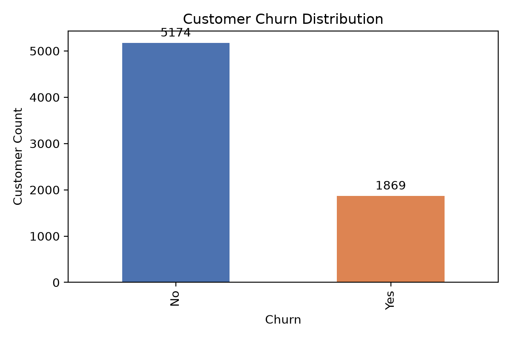
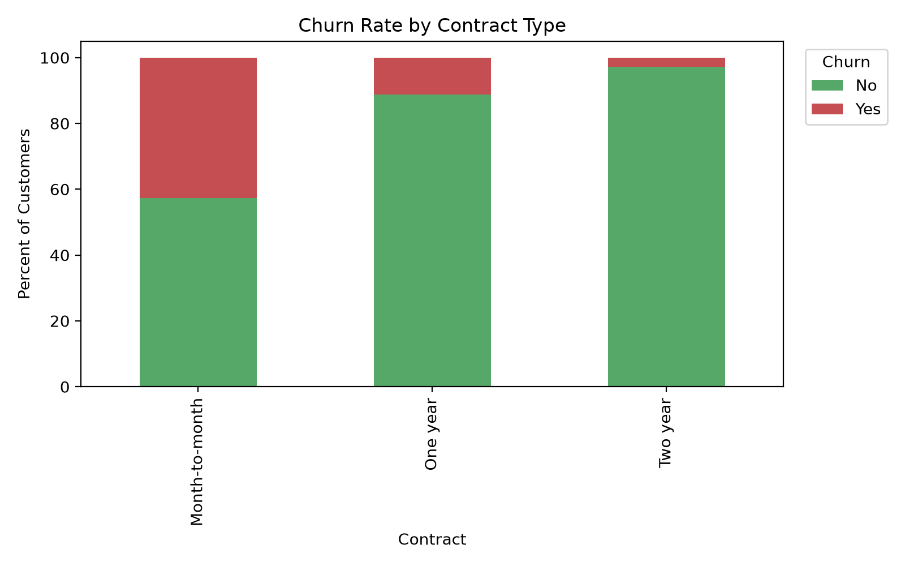
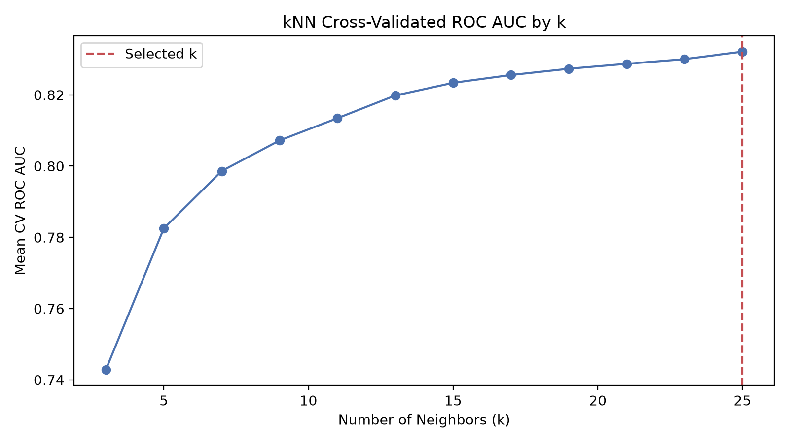
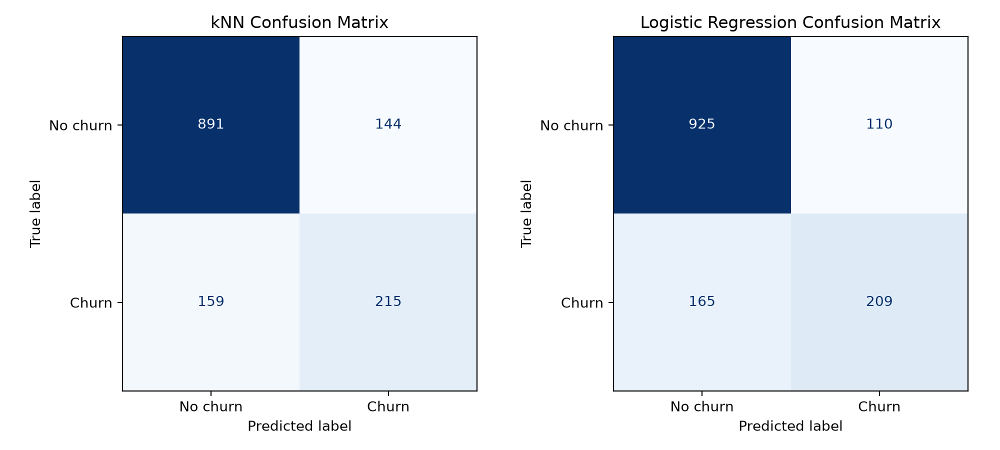
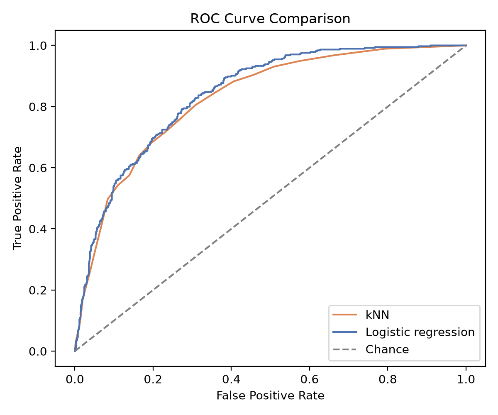

# Telecom Customer Churn Classification Report

## Overview

This submission applies the k-Nearest Neighbors (kNN) method to the provided telecom churn data and compares the resulting classifier with a logistic regression benchmark built from the same train/test split. The analysis is reproducible through `/home/runner/work/Application-Customer-Classification/Application-Customer-Classification/analysis.py`, and the generated outputs are stored in `/home/runner/work/Application-Customer-Classification/Application-Customer-Classification/outputs/`.

The data set contains 7,043 customers and 21 variables, including service usage, billing, contract type, and churn outcome. After loading the data, `TotalCharges` was converted to numeric form, 11 blank values were treated as missing, and the customer identifier column was excluded from modeling because it is not a predictive feature.

## 1. Applying the kNN method to the data set

### Data annotation and preparation

The target variable is `Churn`, coded as **Yes = 1** and **No = 0**. The explanatory variables include both numeric fields (`SeniorCitizen`, `tenure`, `MonthlyCharges`, and `TotalCharges`) and categorical service/account fields such as `Contract`, `InternetService`, and `PaymentMethod`. Because kNN relies on distance between observations, numeric variables were standardized and categorical variables were one-hot encoded so that no single raw scale could dominate the distance calculation. This preprocessing choice follows the standard guidance that kNN is highly sensitive to feature scale and irrelevant dimensions (Cunningham & Delany, 2021; Zhang, 2016).

The model evaluation workflow used:

1. an 80/20 stratified train/test split,
2. 5-fold stratified cross-validation on the training data,
3. ROC AUC as the tuning criterion for selecting the value of *k*, and
4. final holdout evaluation using accuracy, precision, recall, F1, and ROC AUC.

The response distribution shows that churn is the minority class, which matters because accuracy alone can overstate performance on imbalanced data.

The data also show a strong descriptive relationship between contract type and churn. Month-to-month customers churned far more often than customers on annual contracts.

Observed contract-level churn rates from the data were:

| Contract type | Churn rate |
| --- | ---: |
| Month-to-month | 42.71% |
| One year | 11.27% |
| Two year | 2.83% |

These descriptive patterns are consistent with the business interpretation that short commitments are associated with greater churn risk.

### kNN model fitting

The kNN model was tuned across odd values of *k* from 3 to 25, with both uniform and distance weighting and both Manhattan and Euclidean distance variants. The best model used **25 neighbors**, **uniform weighting**, and **Euclidean distance** (`p = 2`). Cross-validated ROC AUC improved steadily as *k* increased, indicating that a smoother neighborhood definition reduced sensitivity to noise in this data set.

The selected kNN model achieved a **cross-validated ROC AUC of 0.832** on the training folds and the following holdout-set performance:

| Metric | kNN |
| --- | ---: |
| Accuracy | 0.785 |
| Precision | 0.599 |
| Recall | 0.575 |
| F1 | 0.587 |
| ROC AUC | 0.827 |

### Interpretation of the kNN results

The confusion matrix shows that the kNN model correctly identified 215 churners and 891 non-churners on the test set, while misclassifying 159 churners as non-churners and 144 non-churners as churners.

The ROC curve indicates that kNN separates churners from non-churners substantially better than random guessing, but not as strongly as logistic regression in this experiment.

Substantively, the kNN results suggest that the telecom data contain meaningful local neighborhoods: customers with similar contracts, charges, tenure, and service bundles often share the same churn behavior. That said, the moderate recall value shows that many churners still sit near non-churners in the transformed feature space, which is common when churn depends on multiple overlapping business factors rather than a single clear boundary (Cunningham & Delany, 2021; Zhang, 2016).

## 2. Assumptions and limitations of the kNN method

kNN is a non-parametric, instance-based classifier, so it makes fewer structural assumptions than a model with an explicit parametric equation. However, it still depends on important practical assumptions:

- **Local similarity assumption:** customers that are close in feature space are expected to have similar outcomes. If nearby customers do not share churn behavior, kNN will be unreliable (Zhang, 2016).
- **Meaningful distance assumption:** the selected distance metric must reflect business similarity. Poor scaling or weak feature engineering can make “nearest” neighbors misleading (Cunningham & Delany, 2021).
- **Stable feature representation:** irrelevant features, high-cardinality encoding, and sparse dimensions can dilute neighborhood quality. This is an important issue here because many predictors are categorical and become multiple binary columns after one-hot encoding (Cunningham & Delany, 2021).

The main limitations in this assignment are:

1. **Sensitivity to scaling.** Without standardization, features such as `TotalCharges` and `MonthlyCharges` would dominate the distance calculation (Cunningham & Delany, 2021).
2. **Curse of dimensionality.** After one-hot encoding, customer records occupy a higher-dimensional space, which can reduce the discriminating power of distance-based methods (Cunningham & Delany, 2021).
3. **Prediction-time cost.** kNN stores the training set and compares each new case to many existing cases, so prediction is usually more computationally expensive than a fitted linear model (Zhang, 2016).
4. **Limited interpretability.** kNN can say which neighboring records are similar, but it does not directly provide coefficient-style explanations for how each predictor changes churn risk (Cunningham & Delany, 2021).
5. **Class imbalance sensitivity.** Because most customers do not churn, local neighborhoods can be dominated by the majority class unless the analyst actively checks recall, precision, and threshold-independent metrics (Fawcett, 2006).

These limitations explain why the model was tuned with cross-validation and judged with multiple metrics instead of accuracy alone.

## 3. Comparison of kNN and logistic regression

### Evaluation framework

Both models used the same:

- cleaned data set,
- stratified 80/20 train/test split,
- preprocessing pipeline (imputation, scaling, and one-hot encoding), and
- holdout metrics: accuracy, precision, recall, F1, and ROC AUC.

The kNN model was tuned by 5-fold stratified cross-validation using ROC AUC. Logistic regression was then fit on the same training data with the same transformed predictors, which makes the comparison fair because differences in performance are driven by the learning algorithm rather than by different data preparation steps. Using ROC AUC together with precision, recall, and F1 is appropriate because churn is imbalanced and each metric highlights a different aspect of classification quality (Fawcett, 2006; Géron, 2022).

### Model comparison results

| Metric | kNN | Logistic regression |
| --- | ---: | ---: |
| Accuracy | 0.785 | **0.805** |
| Precision | 0.599 | **0.655** |
| Recall | **0.575** | 0.559 |
| F1 | 0.587 | **0.603** |
| ROC AUC | 0.827 | **0.841** |

### Which model performed better?

Using the evaluation framework above, **logistic regression performed better overall**. It produced higher accuracy, precision, F1, and ROC AUC on the holdout set, while kNN achieved only a slightly higher recall. This pattern suggests that the churn boundary in the transformed feature space is captured more efficiently by a regularized linear decision surface than by neighborhood voting alone. Logistic regression also delivered fewer false positives and a stronger overall ranking of churn risk, as seen in the ROC curve and confusion matrix.

From an applied business perspective, the choice depends on the objective:

- If the goal is to maximize overall discrimination and produce a more stable, explainable classifier, logistic regression is the better model in this analysis.
- If the analyst is willing to accept more false positives in exchange for catching a few more churners, kNN remains defensible because its recall was marginally higher.

Even so, the combined evidence favors logistic regression as the preferred final model for this data set.

## 4. Separate detailed comparison document

A more detailed, model-by-model comparison is provided in `/home/runner/work/Application-Customer-Classification/Application-Customer-Classification/COMPARISON.md`.

## References

- Bewick, V., Cheek, L., & Ball, J. (2005). Statistics review 14: Logistic regression. *Critical Care, 9*(1), 112-118. https://pmc.ncbi.nlm.nih.gov/articles/PMC1065119/
- Cunningham, P., & Delany, S. J. (2021). k-Nearest neighbour classifiers: A tutorial. *ACM Computing Surveys, 54*(6), Article 128. https://doi.org/10.1145/3459665
- Fawcett, T. (2006). An introduction to ROC analysis. *Pattern Recognition Letters, 27*(8), 861-874. https://doi.org/10.1016/j.patrec.2005.10.010
- Géron, A. (2022). *Hands-on machine learning with Scikit-Learn, Keras, and TensorFlow* (3rd ed.). O'Reilly Media.
- Harris, J. K. (2021). Primer on binary logistic regression. *Family Medicine and Community Health, 9*, e001290. https://fmch.bmj.com/content/9/4/e001290
- Zhang, Z. (2016). Introduction to machine learning: k-nearest neighbors. *Annals of Translational Medicine, 4*(11), 218. https://pmc.ncbi.nlm.nih.gov/articles/PMC4916348/
