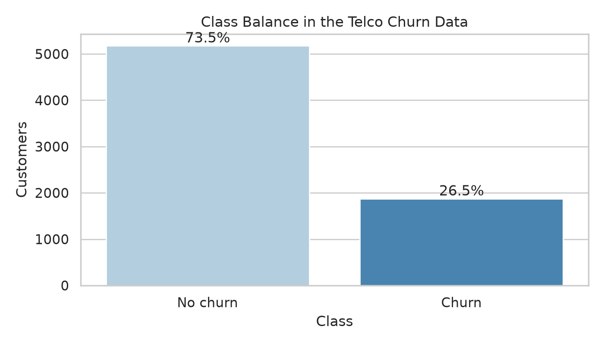
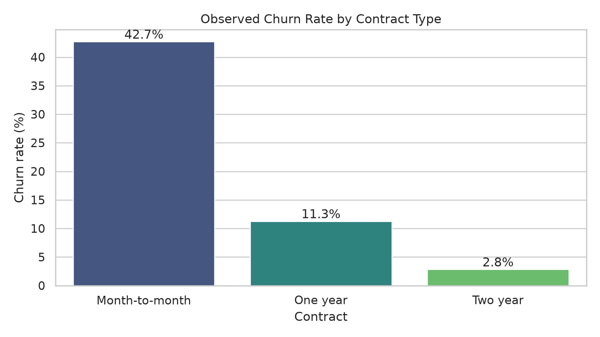
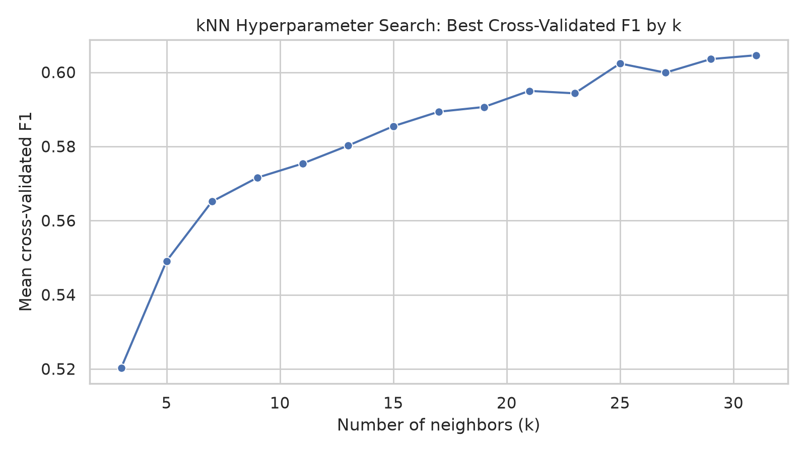
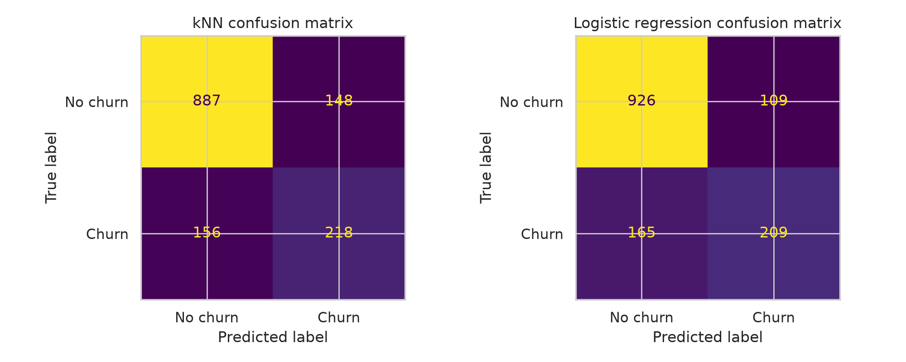
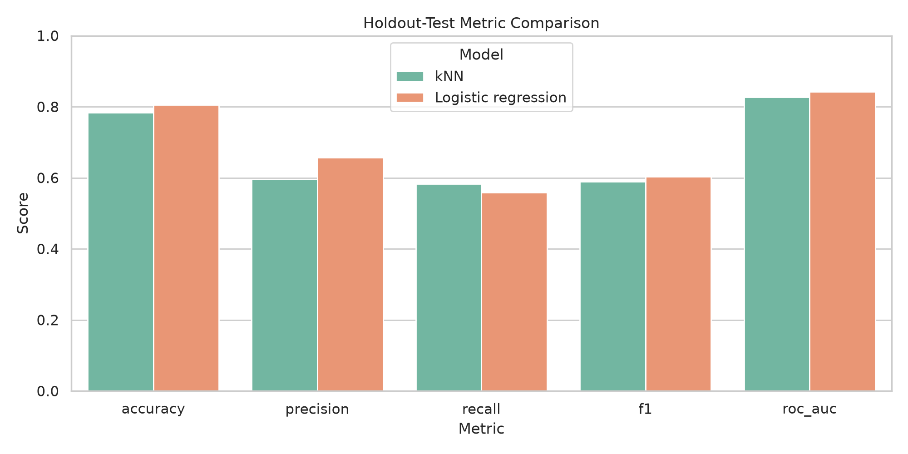
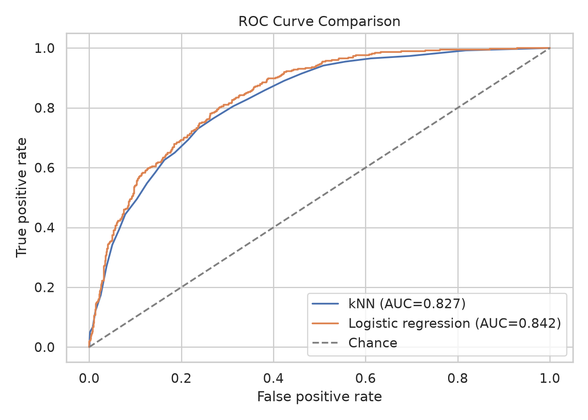

# Telco Customer Churn Classification Report

## 1. Objective and data source
This report applies the k-Nearest Neighbors (kNN) method to the IBM Telco Customer Churn data and compares its performance with a logistic regression benchmark trained on the same split and preprocessing workflow. kNN is a non-parametric classifier that assigns a class based on the labels of nearby observations in feature space, so data preparation and distance scaling are central to the method (Hastie, Tibshirani, & Friedman, 2009; James et al., 2021).

The reproducible analysis script is `/home/runner/work/Application-Customer-Classification/Application-Customer-Classification/analysis/generate_telco_report.py`. By default it uses the public IBM Telco churn CSV equivalent to the attached dataset and also supports a local Excel file through `--input`.

## 2. Applying the kNN method
### 2.1 Data preparation
The workflow used the following preparation steps before fitting either model:
- converted `TotalCharges` to numeric and treated blank values as missing;
- removed `customerID` because it is an identifier, not a predictive attribute;
- median-imputed numeric features and mode-imputed categorical features;
- one-hot encoded categorical variables;
- standardized numeric predictors so that distance calculations in kNN were not dominated by variables with larger scales (Kuhn & Johnson, 2013).

The final data set contained 7,043 observations and 21 columns. Eleven `TotalCharges` values were missing after numeric conversion and were imputed in the pipeline. The target was moderately imbalanced, with 5,174 non-churn cases and 1,869 churn cases.

**Interpretation.** The class distribution shows that churn is the minority class at roughly 26.5%. Because of that imbalance, F1-score and recall are useful alongside accuracy; accuracy alone can exaggerate performance when the majority class is much larger (James et al., 2021).

### 2.2 Exploratory visualization

**Interpretation.** Month-to-month customers had the highest observed churn rate at 42.7%, compared with 11.3% for one-year contracts and 2.8% for two-year contracts. This suggests that customer commitment length is strongly associated with churn risk, which is consistent with how telecom churn is typically studied in applied classification settings.

### 2.3 kNN training and tuning
The data were split with stratification into 80% training and 20% test sets using `random_state=42`. On the training portion, kNN was tuned with 5-fold stratified cross-validation over odd `k` values from 3 to 31, distance weighting options, and both Manhattan (`p=1`) and Euclidean (`p=2`) distance. F1-score was used as the tuning metric because it balances precision and recall on the minority churn class (Pedregosa et al., 2011).

The best model used:
- `k = 31`
- `weights = uniform`
- `p = 1` (Manhattan distance)

**Interpretation.** The tuning curve favored a relatively large neighborhood. That pattern suggests the data benefited from smoothing rather than from highly local decisions, which is common when one-hot encoded business data create sparse neighborhoods.

### 2.4 kNN results
The selected kNN model achieved the following results:

| Evaluation stage | Accuracy | Precision | Recall | F1-score | ROC-AUC |
| --- | ---: | ---: | ---: | ---: | ---: |
| 5-fold CV mean | 0.7943 | 0.6167 | 0.5933 | 0.6046 | 0.8340 |
| Holdout test | 0.7842 | 0.5956 | 0.5829 | 0.5892 | 0.8268 |

**Interpretation.** On the test set, the kNN model correctly classified 887 non-churn customers and 218 churn customers, while missing 156 churn cases. The model showed reasonable discrimination, but the drop from cross-validation to test performance suggests only moderate generalization strength. The test ROC-AUC of 0.8268 still indicates useful separation between churn and non-churn customers.

## 3. Assumptions and limitations of kNN
kNN makes fewer distributional assumptions than parametric models, but it still depends on several practical conditions:
- **Local similarity must be meaningful.** kNN assumes nearby cases tend to belong to the same class. If the feature representation is poor, “nearness” loses value (Hastie et al., 2009).
- **Scaling matters.** Because the method is distance-based, unscaled numeric variables can distort neighbor relationships.
- **High dimensionality can hurt performance.** One-hot encoding many categorical fields increases sparsity and can weaken distance calculations, a version of the curse of dimensionality (James et al., 2021).
- **Prediction can be computationally expensive.** kNN stores the training data and must compare new cases to many prior observations at prediction time.
- **Class imbalance can bias neighbor votes.** With fewer churn cases, local neighborhoods may still lean toward the non-churn majority unless tuning and evaluation are handled carefully.

In this assignment, the main limitations are the minority churn class, the sensitivity of kNN to encoding and scaling choices, and the possibility that different train/test splits could shift the exact best `k`.

## 4. Comparing kNN and logistic regression
The comparison used the same preprocessing pipeline, the same stratified train/test split, and the same 5-fold stratified cross-validation design for both models. This keeps the evaluation framework fair because any performance difference is more likely to reflect the model rather than differences in data preparation (Kuhn & Johnson, 2013).

On the holdout test set, logistic regression performed better on:
- accuracy: **0.8055** vs **0.7842** for kNN;
- precision: **0.6572** vs **0.5956**;
- F1-score: **0.6040** vs **0.5892**;
- ROC-AUC: **0.8419** vs **0.8268**.

kNN had a small recall advantage:
- recall: **0.5829** vs **0.5588** for logistic regression.

**Interpretation.** Logistic regression is the stronger overall model for this data because it produced the best balanced performance on the selected framework’s main criteria, especially F1-score and ROC-AUC. kNN remained competitive and recovered slightly more churn cases, but its lower precision and lower overall discrimination make it less attractive as the primary model for this assignment.

A more detailed comparison is provided in `/home/runner/work/Application-Customer-Classification/Application-Customer-Classification/reports/model_comparison.md`.

## References
- Hastie, T., Tibshirani, R., & Friedman, J. (2009). *The Elements of Statistical Learning*.
- James, G., Witten, D., Hastie, T., & Tibshirani, R. (2021). *An Introduction to Statistical Learning*.
- Kuhn, M., & Johnson, K. (2013). *Applied Predictive Modeling*.
- Pedregosa, F., et al. (2011). Scikit-learn: Machine learning in Python. *Journal of Machine Learning Research*, 12, 2825-2830.
